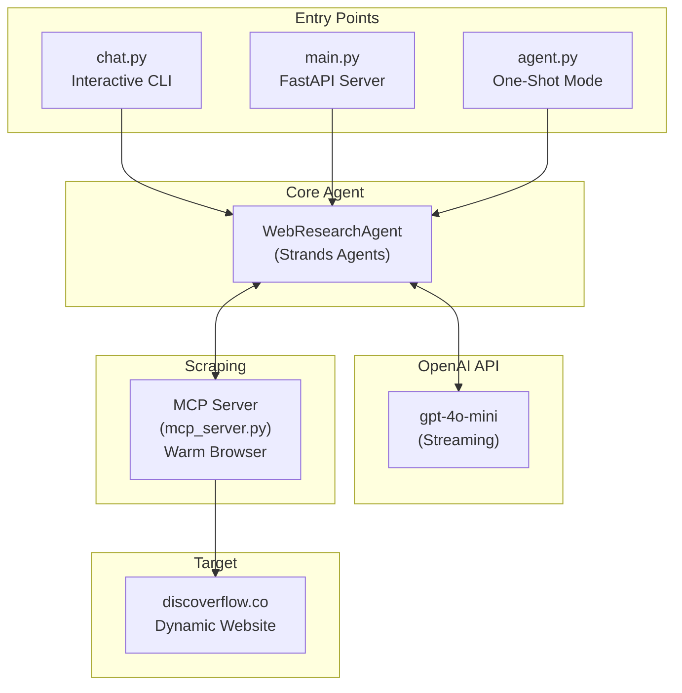
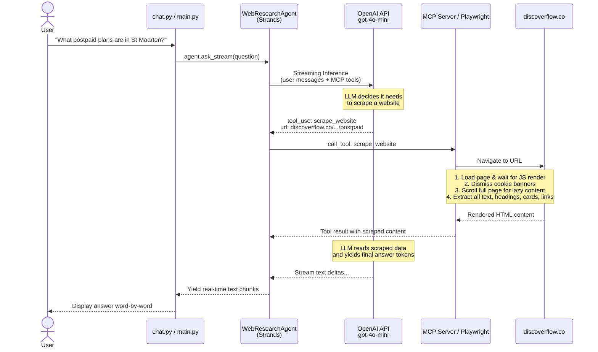
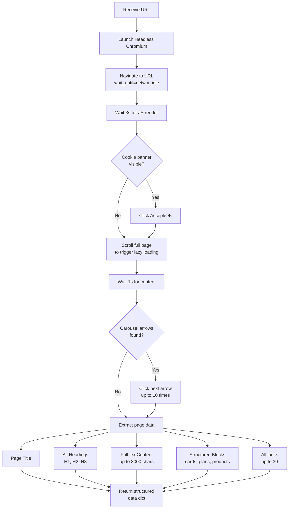
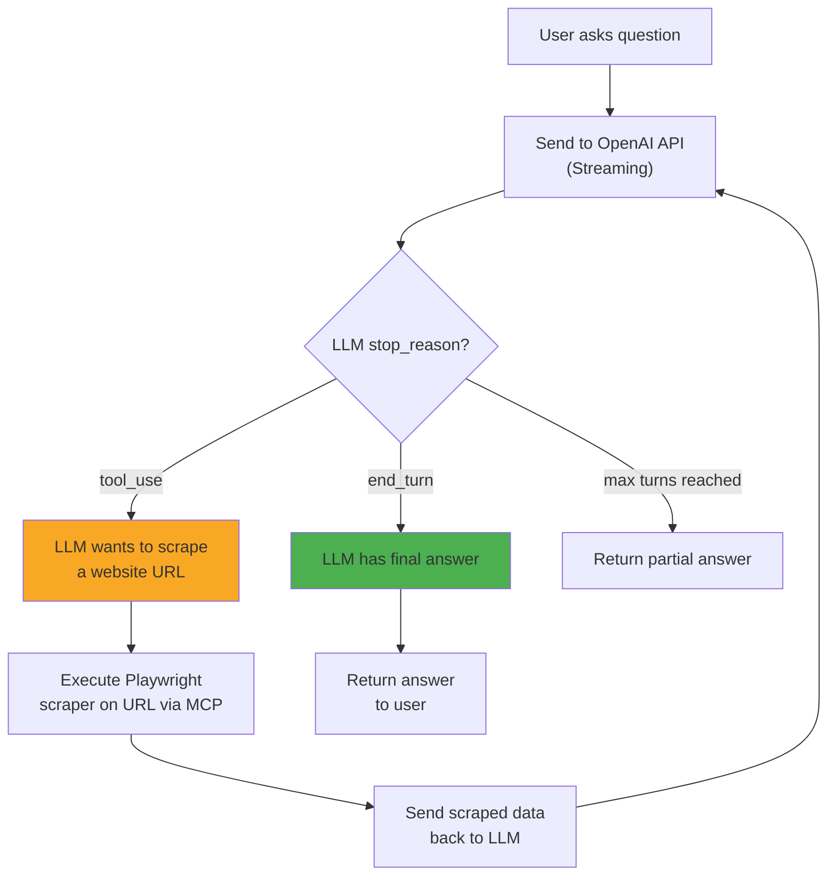

# DiscOverflow AI Web Research Agent

An AI-powered web research agent that scrapes dynamic, JavaScript-rendered content from [discoverflow.co](https://discoverflow.co/) in real-time using a **Playwright headless browser** via **MCP** and answers questions using **OpenAI API** (`gpt-4o-mini`) orchestrated by **Strands Agents**.

---

## Features

- **Real-Time Dynamic Scraping** -- Playwright headless browser renders JavaScript-heavy pages and extracts all content
- **AI-Powered Analysis** -- OpenAI API (gpt-4o-mini) evaluates scraped content and provides detailed answers
- **Interactive Chat Mode** -- Multi-turn conversational interface with streaming real-time output
- **REST API Server** -- FastAPI endpoints for programmatic access
- **MCP Server** -- Model Context Protocol server keeps browser warm for fast scraping
- **Strands Agents Integration** -- Robust agent state management and asynchronous streaming with native MCP tool calling
- **Latency Tracking** -- Per-question breakdown of scraping vs LLM inference time

---

## Architecture Overview



---

## Detailed Agent Flow

This is the complete flow from when a user asks a question to when they receive an answer:



---

## Scraper Detail Flow

What happens inside the Playwright scraper when it visits a page:



---

## Tool Calling Flow

How the LLM decides when to use the scraper tool:



---

## Project Structure

```
swp/
  agent.py          # WebResearchAgent class (core logic)
                    #   - Strands Agents integration
                    #   - OpenAI streaming support
                    #   - MCPClient setup and event hooks
                    #   - Scraper SDK interfacing
                    #   - Also runs as one-shot CLI

  chat.py           # Interactive chat CLI
                    #   - Imports WebResearchAgent from agent.py
                    #   - Multi-turn conversation loop
                    #   - Latency display and streaming output

  main.py           # FastAPI REST API server
                    #   - POST /ask     (stateless question)
                    #   - POST /chat    (session-based chat)
                    #   - POST /scrape  (direct URL scraping via MCP)
                    #   - GET  /health  (health check)

  mcp_server.py     # MCP Server for warm-browser scraping
                    #   - Persistent Playwright browser
                    #   - SSE transport on port 8080

  scraper.py        # Playwright headless browser scraper
                    #   - Cookie banner dismissal
                    #   - Full page scrolling
                    #   - Carousel navigation
                    #   - Structured content extraction

  requirements.txt  # Python dependencies
  .gitignore        # Git ignore rules
```

---

## API Endpoints (main.py)

| Method | Endpoint | Description |
|--------|----------|-------------|
| `GET` | `/health` | Health check, returns model info |
| `POST` | `/ask` | One-shot question (no memory) |
| `POST` | `/chat` | Chat with session memory |
| `POST` | `/chat/{id}/reset` | Reset a chat session |
| `POST` | `/scrape` | Scrape a URL directly |

**Example request:**
```bash
curl -X POST http://localhost:8000/ask \
  -H "Content-Type: application/json" \
  -d '{"question": "What postpaid plans are in St Maarten?"}'
```

**Example response:**
```json
{
  "answer": "The postpaid plans in St. Maarten are:\n- $15/month: 2GB, 50 min, 20 msg\n...",
  "total_time": 18.5,
  "scrape_time": 15.2,
  "llm_time": 3.3
}
```

---

## Local Setup

### Prerequisites

- **Python 3.10+**
- **OpenAI API Key** (`OPENAI_API_KEY` environment variable configured with a valid testing key)

### Installation

```bash
# Clone the repository
git clone https://github.com/giridharpalla/web-scrapping-crewai-bedrock.git
cd web-scrapping-crewai-bedrock

# Create virtual environment
python -m venv venv

# Activate (Windows)
.\venv\Scripts\Activate.ps1

# Activate (macOS/Linux)
source venv/bin/activate

# Install dependencies
pip install -r requirements.txt

# Install Playwright browsers
playwright install chromium
```

---

## Running

### Interactive Chat (MCP Mode - Warm Browser)
```bash
# Terminal 1: Start the MCP server (keeps browser warm)
python mcp_server.py

# Terminal 2: Start the chat connected to MCP server
set OPENAI_API_KEY=sk-...
set MCP_SERVER_URL=http://localhost:8080/sse
python chat.py
```

### One-Shot Agent
```bash
set OPENAI_API_KEY=sk-...
python agent.py
```

### REST API Server
```bash
set OPENAI_API_KEY=sk-...
uvicorn main:app --reload --port 8000
# Then visit http://localhost:8000/docs for Swagger UI
```

---

## Example Chat Session

```
============================================================
  DiscOverflow Chat - Powered by gpt-4o-mini
  Scraper: MCP Server (http://localhost:8080/sse)
  Streaming: ON (real-time word-by-word output)
  Ask me anything about discoverflow.co!
  Type 'quit' or 'exit' to stop.
============================================================

You: what postpaid plans are in st maarten?

  [Scraping https://discoverflow.co/en/web/st-maarten/mobile/plans/postpaid...]
  [Done - 11835 chars]
  
A: The postpaid plans available in St. Maarten are:

  * $15/month: 2GB data, 50 minutes, 20 messages
  * $25/month: 3GB data, 70 minutes, 50 messages
  ...

  [Latency: total=18.5s | scraping=15.2s | LLM=3.3s]
```

---

## Tech Stack

| Component | Technology |
|-----------|-----------|
| LLM API | OpenAI API (gpt-4o-mini) |
| Framework | Strands Agents |
| Web Scraping | Playwright (headless Chromium) |
| Tool Protocol | MCP (Model Context Protocol) |
| API Layer | FastAPI + Uvicorn |
| Language | Python 3.10+ |
